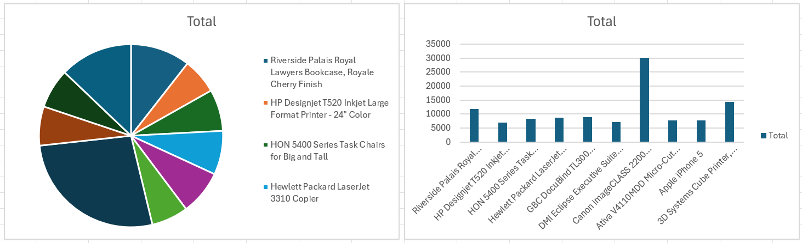
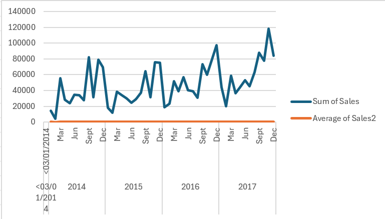

# 📊 STC TV Data Analysis

This project is part of Task 1 from the Misk Foundation Data Analysis Program.  
The goal is to analyze user behavior on the STC TV platform based on content type and video quality.

---

## 🎯 Objectives

- Classify viewers by program type: **Movies** vs **Series**
- Analyze viewing patterns: **HD** vs **SD**
- Compute key statistics:
  - Mean
  - Standard Deviation
  - Minimum & Maximum
- Clean and explore missing data

---

## 🧰 Tools Used

- Python (for data cleaning and analysis)
- pandas, numpy
- **Excel** (for creating visual charts and visualizations)

---

## 📂 Dataset

- Original format: `.xlsb`
- Converted to: `.xlsx` for compatibility with pandas

---

## 🧪 Analysis Steps

1. Load and inspect the dataset  
2. Clean null values  
3. Group data by:
   - `program_class` (Movie / Series)  
   - `hd` (HD / SD)  
4. Analyze viewing duration and preferences

---

## 📁 Files

- `stc_analysis.ipynb` — Jupyter Notebook with the full analysis
- `README.md` — Project description

- ## 📷 Visualizations

Here are the key visualizations from the analysis:

---

## ✅ Summary

The analysis shows differences in viewing behavior based on content type and video quality, helping to understand STC TV user preferences better.
